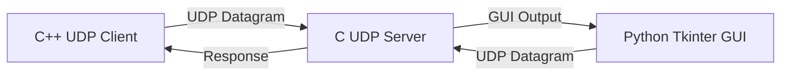

##  UDP Client-Server Project

A complete cross-language **UDP socket programming project** built using **C**, **C++**, and **Python**.
This project demonstrates **connectionless communication**, **real-time datagram transfer**, and **GUI-based network interaction** using the UDP protocol.

Designed for students, networking enthusiasts, embedded systems learners, and systems programmers exploring transport-layer communication.

---

[](https://en.wikipedia.org/wiki/User_Datagram_Protocol)
[](https://en.wikipedia.org/wiki/Computer_network_programming)
[](https://en.wikipedia.org/wiki/Network_socket)
[](https://en.wikipedia.org/wiki/Connectionless_communication)
[](https://en.wikipedia.org/wiki/Client%E2%80%93server_model)
[](https://en.wikipedia.org/wiki/C_(programming_language))
[](https://en.wikipedia.org/wiki/Real-time_computing)
[](https://en.wikipedia.org/wiki/Latency_(engineering))
[](https://en.wikipedia.org/wiki/Datagram)
[](https://en.wikipedia.org/wiki/Transport_layer)
[](https://en.wikipedia.org/wiki/Internet_Protocol)
[](https://en.wikipedia.org/wiki/Berkeley_sockets)
[](https://en.wikipedia.org/wiki/Best-effort_delivery)
[](https://en.wikipedia.org/wiki/Streaming_media)
[](https://en.wikipedia.org/wiki/Message_oriented_middleware)
[](https://en.wikipedia.org/wiki/Network_utility)
[](https://en.wikipedia.org/wiki/Unix_domain_socket)
[](https://en.wikipedia.org/wiki/Multicast)
[](https://en.wikipedia.org/wiki/Port_(computer_networking))
[](https://en.wikipedia.org/wiki/Asynchronous_I/O)
[](https://en.wikipedia.org/wiki/Protocol_overhead)
[](https://en.wikipedia.org/wiki/Voice_over_IP)
[](https://en.wikipedia.org/wiki/Online_game)
[](https://en.wikipedia.org/wiki/Domain_Name_System)
[](https://en.wikipedia.org/wiki/Thread_(computing))
[](https://en.wikipedia.org/wiki/Cross-platform)
[](https://en.wikipedia.org/wiki/Educational_technology)


<p align="center">


</p>

---

# Table of Contents

* [Overview](#overview)
* [UDP Fundamentals](#udp-fundamentals)
* [Features](#features)
* [Architecture](#architecture)
* [Project Structure](#project-structure)
* [Installation](#installation)
* [Build Instructions](#build-instructions)
* [Running the Project](#running-the-project)
* [GUI Application](#gui-application)
* [How It Works](#how-it-works)
* [UDP vs TCP](#udp-vs-tcp)
* [Mini Network Diagrams](#mini-network-diagrams)
* [Socket Programming Concepts](#socket-programming-concepts)
* [Future Improvements](#future-improvements)
* [Learning Outcomes](#learning-outcomes)
* [Contributing](#contributing)
* [License](#license)

---

# Overview

This project implements a complete UDP-based communication system consisting of:

* A **C UDP server**
* A **C++ UDP client**
* A **Python Tkinter GUI**
* Cross-language socket communication
* Real-time message transfer over UDP

The simulator demonstrates how lightweight connectionless protocols work internally using BSD sockets and transport-layer networking concepts.

---

# UDP Fundamentals

UDP (**User Datagram Protocol**) is a transport-layer communication protocol that provides fast, low-overhead communication without establishing a connection.

Unlike TCP:

* No handshake mechanism
* No guaranteed delivery
* No packet ordering
* Minimal protocol overhead
* Faster transmission speeds

UDP is widely used in:

* Real-time streaming
* Online gaming
* VoIP systems
* DNS
* Embedded systems
* Sensor networks
* Live communication systems

---

# Features

## Networking Features

* UDP socket communication
* Connectionless datagram transfer
* Client-server architecture
* BSD socket programming
* Loopback communication (`127.0.0.1`)
* Lightweight transport layer communication

---

## Cross-Language Integration

| Component     | Language |
| ------------- | -------- |
| UDP Server    | C        |
| UDP Client    | C++      |
| GUI Interface | Python   |

---

## GUI Features

* Message input/output windows
* Real-time communication visualization
* Client-side message display
* Server-side message display
* Interactive Tkinter interface

---

# Architecture



---

# Project Structure

```text id="j4r1gt"
UDP/
│
├── SERVER/
│   └── server.c
│
├── CLIENT/
│   └── client.cpp
│
├── APPLICATION_GUI/
│   └── gui.py
│
├── Makefile
├── LICENSE
└── README.md
```

---

# Installation

## Requirements

Install the required dependencies:

* GCC
* G++
* Python 3
* Tkinter
* Make

---

## Ubuntu / Debian Setup

```bash id="2cz2i9"
sudo apt update

sudo apt install build-essential \
python3 \
python3-tk \
make
```

---

# Build Instructions

## Clone Repository

```bash id="d3ys3r"
git clone https://github.com/jsramesh1990/UDP-project.git

cd UDP-project
```

---

## Build Using Makefile

```bash id="r9nmlv"
make
```

---

## Clean Build Files

```bash id="j2dd67"
make clean
```

---

# Running the Project

## Step 1 — Start UDP Server

```bash id="1q6wyx"
./server
```

Server listens on:

```text id="9h7zv8"
127.0.0.1:8080
```

---

## Step 2 — Run UDP Client

```bash id="rz4c70"
./client
```

Type messages into the terminal and send them directly to the UDP server.

---

## Step 3 — Launch Python GUI

```bash id="cz9r20"
python3 APPLICATION_GUI/gui.py
```

---

# GUI Application

## GUI Features

### Client Panel

* Message input box
* Send button
* Client output display
* Real-time communication logs

---

### Server Panel

* Server-side message display
* Local testing simulation
* Response visualization

---

## GUI Layout

```text id="6nq3r2"
┌───────────────────────────────────┐
│         UDP GUI INTERFACE         │
├───────────────────────────────────┤
│ Client Input                      │
│ [ Enter Message Here ] [Send]     │
├───────────────────────────────────┤
│ Client Output                     │
│ Hello Server                      │
│ Server Reply                      │
├───────────────────────────────────┤
│ Server Output                     │
│ Packet Received                   │
└───────────────────────────────────┘
```

---

# How It Works

## Communication Flow

```text id="9kkbje"
Client
   │
   │ UDP Datagram
   ▼
Server
   │
   │ Response Datagram
   ▼
Client
```

---

## Internal Workflow

1. Client creates UDP socket
2. Message is converted into a datagram
3. Datagram is sent to server
4. Server receives packet
5. Server processes data
6. Optional response sent back
7. GUI visualizes communication

---

# UDP vs TCP

| Feature         | UDP              | TCP                 |
| --------------- | ---------------- | ------------------- |
| Connection Type | Connectionless   | Connection-Oriented |
| Reliability     | Unreliable       | Reliable            |
| Ordering        | Not Guaranteed   | Guaranteed          |
| Speed           | Faster           | Slower              |
| Overhead        | Low              | Higher              |
| Handshake       | No               | Yes                 |
| Use Cases       | Streaming, Games | Web, Email, FTP     |

---

# Mini Network Diagrams

## UDP Communication Model

```text id="yr9g3f"
┌───────────┐
│  Client   │
└─────┬─────┘
      │ Datagram
      ▼
┌───────────┐
│  Server   │
└───────────┘
```

---

## Cross-Language Communication

```text id="4n17gj"
C++ Client
      │
      ▼
UDP Socket Layer
      ▲
      │
C Server
      ▲
      │
Python GUI
```

---

## Datagram Transmission

```text id="rmp5hb"
[Message]
     ↓
[UDP Header]
     ↓
[IP Packet]
     ↓
[Network Transmission]
```

---

# Socket Programming Concepts

## UDP Socket Creation

```cpp id="9o4mb2"
int sockfd = socket(AF_INET, SOCK_DGRAM, 0);
```

---

## Sending Datagram

```cpp id="ys4xf6"
sendto(sockfd,
       buffer,
       strlen(buffer),
       0,
       (struct sockaddr*)&serverAddr,
       sizeof(serverAddr));
```

---

## Receiving Datagram

```c id="94f8g5"
recvfrom(sockfd,
         buffer,
         sizeof(buffer),
         0,
         (struct sockaddr*)&clientAddr,
         &addrLen);
```

---

# Makefile Targets

| Command       | Description             |
| ------------- | ----------------------- |
| `make`        | Build server and client |
| `make server` | Build only server       |
| `make client` | Build only client       |
| `make clean`  | Remove binaries         |

---

# Future Improvements

## Planned Features

* Multi-client support
* Threaded UDP server
* Real-time GUI updates
* Packet loss simulation
* Logging system
* Non-blocking sockets
* IPv6 support
* Multicast communication
* Encryption layer
* Network statistics dashboard

---

# Learning Outcomes

By working with this project, users will learn:

* UDP transport-layer communication
* BSD socket programming
* Client-server networking
* Datagram transmission
* Cross-language interoperability
* Real-time communication systems
* GUI-based networking tools
* Connectionless protocol design

---

# Contributing

Contributions are welcome.

## Suggested Areas

* GUI enhancements
* Networking improvements
* Threaded communication
* Error handling
* Protocol extensions
* Performance monitoring

---

## Contribution Workflow

```bash id="m3qg9v"
# Fork repository

# Create feature branch
git checkout -b feature/new-feature

# Commit changes
git commit -m "Add new feature"

# Push changes
git push origin feature/new-feature
```

Then create a Pull Request.

---

# About

This project demonstrates practical UDP socket programming using multiple programming languages and GUI-based interaction.

It is useful for understanding:

* Transport-layer networking
* Lightweight communication systems
* Embedded networking
* Real-time datagram protocols
* Client-server architectures

without requiring complex external dependencies.

---

<p align="center">

### ⭐ Star the repository if you found this project useful.

</p>

